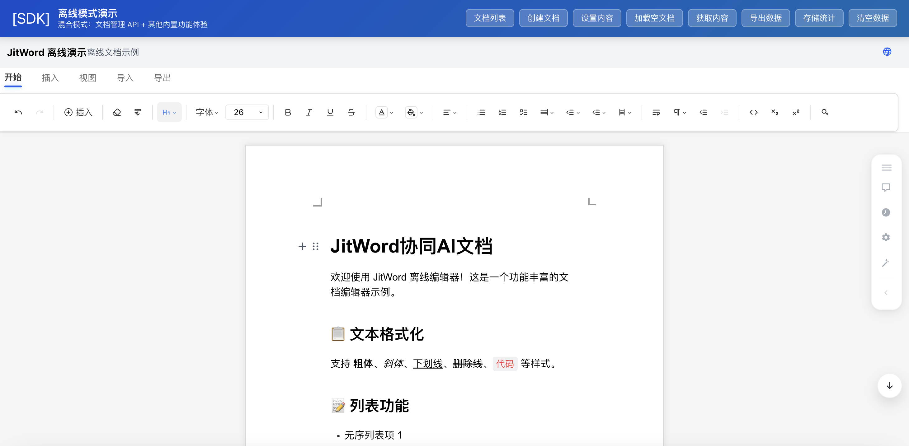

# JitWord Web SDK 使用文档



JitWord SDK 提供了一个简单的方式将强大的协同文档编辑器集成到您的 Web 应用中。支持 Vue、React、Angular 以及原生 HTML/JS 项目。

## 1. 目标

让客户更简单的来接入我们协同文档编辑器，并开放全局可配置，可操控的API，供客户使用。

## 2. SDK 功能设计

### 2.1 实现要求

- **本地 SDK 引入**: 支持通过本地文件引入到项目（后端接口和协同部分需连接远程服务）。
- **多技术栈支持**: 支持 Vue, React, Angular, 原生 HTML 等。
- **API 暴露**: 提供丰富的 API 让开发人员控制编辑器行为。
- **快速上手**: 简单易用，5分钟即可完成接入。
- **完善文档**: 提供详细的 API 和 SDK 使用文档。

## 3. 快速开始 (Quick Start)

### 3.1 引入 SDK

您可以通过本地文件引入 SDK 及其依赖。

```html
<!-- 1. 引入样式 -->
<link rel="stylesheet" href="path/to/arco.css">
<link rel="stylesheet" href="path/to/px-editor.css">

<!-- 2. 引入依赖库 -->
<script src="path/to/vue.global.prod.js"></script>
<script src="path/to/arco-vue.min.js"></script>
<script src="path/to/arco-vue-icon.min.js"></script>
<script src="path/to/echarts.min.js"></script>
<script src="path/to/mind-elixir.js"></script>

<!-- 3. 引入 JitWord SDK -->
<script src="path/to/px-editor.standalone.js"></script>
```

### 3.2 初始化编辑器

在 HTML 中准备一个容器：

```html
<div id="col-editor" style="height: 100vh;"></div>
```

使用 `Jitword` 类初始化：

```javascript
// 确保脚本加载完成后执行
window.onload = function() {
  const { Jitword } = window.PxEditor;

  const editor = new Jitword({
    hold: "col-editor", // 容器 ID
    appTitle: 'JitWord 协作文档',
    logo: 'https://jitword.com/logo.png',
    enableAI: true,
    // ...其他配置
  });
};
```

### 3.3 本地测试与部署

#### ⚠️ 重要提示

**不要直接使用 `file://` 协议打开 HTML 文件！** 这会导致以下问题：

1. **CORS 错误**：浏览器会阻止从 `file://` 向远程 API 发送请求
   ```
   Access to fetch at 'https://api.example.com' from origin 'null' 
   has been blocked by CORS policy
   ```

2. **401 认证失败**：无法正确存储和发送认证 token
   ```
   GET https://api.example.com/documents net::ERR_FAILED 401 (Unauthorized)
   ```

#### ✅ 正确的本地测试方法

**方法 1: 使用 Python 自带的 HTTP 服务器（推荐）**

```bash
# 进入 HTML 文件所在目录
cd /path/to/your/project

# 启动 HTTP 服务器
python3 -m http.server 8080

# 或使用 Python 2
python -m SimpleHTTPServer 8080
```

然后在浏览器访问：`http://localhost:8080/standalone.html`

**方法 2: 使用 Node.js http-server**

```bash
# 安装 http-server (全局)
npm install -g http-server

# 或使用 npx (无需安装)
npx http-server -p 8080

# 启动服务器
http-server -p 8080
```

然后访问：`http://localhost:8080/standalone.html`

**方法 3: 使用 VS Code Live Server 扩展**

1. 安装 VS Code 扩展：**Live Server**
2. 右键点击 HTML 文件
3. 选择 **"Open with Live Server"**
4. 自动在浏览器打开，支持热重载

**方法 4: 使用 PHP 自带服务器**

```bash
php -S localhost:8080
```

#### 📋 测试检查清单

启动本地服务器后，检查以下内容确保正常运行：

- ✅ 浏览器地址栏显示 `http://localhost:8080/...`（不是 `file://`）
- ✅ 浏览器控制台没有 CORS 错误
- ✅ 编辑器正常加载和显示
- ✅ 可以正常编辑文档内容
- ✅ 如果配置了协同功能，可以看到 WebSocket 连接成功

#### 🚀 生产环境部署

将 SDK 文件部署到您的 Web 服务器（如 Nginx、Apache）即可：

```nginx
# Nginx 配置示例
server {
    listen 80;
    server_name your-domain.com;
    
    location / {
        root /path/to/your/sdk/files;
        index standalone.html;
    }
    
    # 配置 CORS（如果需要）
    add_header Access-Control-Allow-Origin *;
}
```

#### 🔧 常见问题排查

**问题 1: 提示 "PxEditor SDK 加载失败"**
- 检查 `px-editor.standalone.js` 文件路径是否正确
- 检查所有依赖文件（vue.global.prod.js、arco-vue.min.js 等）是否都已加载
- 打开浏览器开发者工具 → Network 标签，查看哪个文件加载失败

**问题 2: 编辑器功能异常**
- 清除浏览器缓存（Cmd+Shift+R 或 Ctrl+Shift+R 硬刷新）
- 检查 SDK 版本是否最新（查看文件的 `?v=timestamp` 参数）
- 查看控制台是否有 JavaScript 错误

**问题 3: 协同功能无法连接**
- 检查 `wsServer` 配置是否正确
- 检查 WebSocket 服务器是否运行
- 检查网络防火墙是否阻止 WebSocket 连接

## 4. SDK API 设计

### 4.1 配置项 (Configuration)

初始化 `new Jitword(config)` 时支持以下配置参数：

#### 4.1.1 基础配置

| 参数名 | 类型 | 必填 | 默认值 | 说明 |
| :--- | :--- | :---: | :--- | :--- |
| `hold` | `string` \| `HTMLElement` | **✓** | - | 编辑器挂载的 DOM 节点 ID 或元素对象 |
| `appTitle` | `string` | | `'JitWord 协同文档'` | 应用标题，显示在编辑器头部 |
| `appTitleShort` | `string` | | `'JitWord'` | 应用简短标题，移动端显示 |
| `documentTitle` | `string` | | `'未命名文档'` | 当前文档标题 |
| `logo` / `logoSrc` | `string` | | - | Logo 图片 URL |
| `logoHref` | `string` | | `'/'` | 点击 Logo 跳转的 URL |
| `locale` | `'zh'` \| `'en'` | | `'zh'` | 界面语言 |
| `theme` | `'light'` \| `'dark'` | | `'light'` | 主题模式 |
| `placeholder` | `string` | | `'请输入文档内容...'` | 编辑器空白时的占位文本 |

#### 4.1.2 编辑器功能配置

| 参数名 | 类型 | 必填 | 默认值 | 说明 |
| :--- | :--- | :---: | :--- | :--- |
| `editable` | `boolean` | | `true` | 是否可编辑 |
| `readMode` | `boolean` | | `false` | 只读模式（优先级高于 editable） |
| `showScrollNav` | `boolean` | | `true` | 是否显示右下角滚动导航 |
| `showFloatToolBar` / `showRightToolbar` | `boolean` | | `true` | 是否显示右侧浮动工具栏 |
| `hideToc` | `boolean` | | `false` | 是否隐藏目录（TOC） |
| `hideFooter` | `boolean` | | `false` | 是否隐藏底部状态栏 |
| `hideBubbleMenu` | `boolean` | | `false` | 是否隐藏气泡菜单 |
| `showPageSettings` | `boolean` | | `true` | 是否显示页面设置按钮 |

#### 4.1.3 协同编辑配置

| 参数名 | 类型 | 必填 | 默认值 | 说明 |
| :--- | :--- | :---: | :--- | :--- |
| `enableCollaboration` | `boolean` | | `true` | 是否启用协同编辑 |
| `enableCollaborationCursor` | `boolean` | | `true` | 是否显示协同光标 |
| `wsServer` | `string` | 协同时必填 | - | WebSocket 服务器地址 (例: `wss://example.com/ws`) |
| `currentDocumentId` | `string` | 协同时推荐 | - | 当前文档 ID，用于生成稳定的协同房间名 |
| `roomName` | `string` | | 自动生成 | 协同房间名（不设置时自动使用 `doc-{currentDocumentId}`） |
| `resetCollabState` | `boolean` | | **`false`** | 是否每次刷新生成新房间（false=稳定房间，true=临时房间） |
| `user` | `object` | | - | 用户信息 `{ name: string, color: string }` |

> **⚠️ 重要**: `resetCollabState` 默认为 `false` 以确保协同房间稳定。设为 `true` 会导致每次刷新生成新房间，破坏持久化协作。

#### 4.1.4 数据与回调

| 参数名 | 类型 | 必填 | 默认值 | 说明 |
| :--- | :--- | :---: | :--- | :--- |
| `value` | `object` \| `string` | | - | 文档初始内容（JSON 或 HTML） |
| `enableAutoSave` | `boolean` | | `false` | 是否启用自动保存 |
| `enableAutoLoad` | `boolean` | | `false` | 是否启用自动加载 |
| `onChange` | `(content) => void` | | - | 内容变化回调 |
| `onSave` | `({ content, currentDocumentId }) => void` | | - | 保存回调 |
| `onEditorReady` | `(editor) => void` | | - | 编辑器就绪回调 |
| `uploadAPI` / `uploadFn` | `(file: File) => Promise<string>` | | - | 文件上传函数，返回文件 URL |

#### 4.1.5 离线模式配置

| 参数名 | 类型 | 必填 | 默认值 | 说明 |
| :--- | :--- | :---: | :--- | :--- |
| `offlineMode` | `boolean` | | **`false`** | 是否启用离线模式（使用 localStorage 代替 API） |
| `offlineStorageKey` | `string` | | `'jitword_offline_data'` | 离线数据在 localStorage 中的键名 |

> **🔌 离线模式说明**:
> - 当 `offlineMode: true` 时，所有数据（文档、评论、版本）都存储在浏览器 localStorage 中
> - 离线模式**自动禁用**协同编辑功能（`enableCollaboration` 会被强制设为 `false`）
> - 适用场景：演示、离线体验、无需后端的独立应用
> - ⚠️ 注意：localStorage 有容量限制（~5-10MB），数据仅保存在本地浏览器，无法跨设备同步

#### 4.1.6 API 配置

| 参数名 | 类型 | 必填 | 默认值 | 说明 |
| :--- | :--- | :---: | :--- | :--- |
| `baseApiUrl` | `string` | | - | 后端 API 基础路径（在线模式时必需） |

> **提示**: 如果启用了 `offlineMode`，则 `baseApiUrl` 会被忽略。

#### 4.1.7 UI 事件回调

| 参数名 | 类型 | 说明 |
| :--- | :--- | :--- |
| `onShare` | `() => void` | 点击分享按钮回调 |
| `onAi` | `() => void` | 点击 AI 按钮回调 |
| `onAiSettings` | `() => void` | 点击 AI 设置回调 |
| `onVersion` | `() => void` | 点击版本历史回调 |
| `onDocumentList` | `() => void` | 点击文档列表回调 |
| `onCreateDocument` | `(data) => void` | 创建文档回调 |
| `onSelectDocument` | `(docId) => void` | 选择文档回调 |
| `onExitReadMode` | `() => void` | 退出只读模式回调 |

### 4.2 数据格式说明

`value` 支持 JSON 或 HTML 格式。

#### 支持的数据格式：

**1. JSON 格式 (推荐)**

使用 ProseMirror / Tiptap 标准 JSON 结构：
```json
{
  "type": "doc",
  "content": [
    {
      "type": "heading",
      "attrs": { "level": 1 },
      "content": [{ "type": "text", "text": "标题内容" }]
    },
    {
      "type": "paragraph",
      "content": [{ "type": "text", "text": "正文内容..." }]
    }
  ]
}
```

**2. HTML 格式**

直接传入 HTML 字符串，编辑器会自动解析：
```html
<h1>标题内容</h1>
<p>正文内容...</p>
```

### 4.3 Jitword 实例方法

`Jitword` 实例提供以下方法供外部调用：

#### 4.3.1 编辑器基础方法

| 方法名 | 参数 | 返回值 | 说明 |
| :--- | :--- | :--- | :--- |
| `getJData()` / `getJSON()` | - | `object` | 获取文档 JSON 格式数据 |
| `getHtml()` / `getHTML()` | - | `string` | 获取文档 HTML 格式数据 |
| `setData(data)` / `setContent(data)` | `object \| string` | `void` | 设置文档内容（JSON 或 HTML） |
| `setEditable(editable)` | `boolean` | `void` | 设置编辑器是否可编辑 |
| `getEditor()` | - | `Editor` | 获取底层 TipTap Editor 实例 |
| `setCurrentDocumentId(docId)` | `string` | `void` | 切换当前文档 ID（触发协同房间切换） |
| `destroy()` | - | `void` | 销毁编辑器实例 |

#### 4.3.2 文档管理方法（离线模式）

| 方法名 | 参数 | 返回值 | 说明 |
| :--- | :--- | :--- | :--- |
| `getDocument(docId)` | `string` | `Promise<Document>` | 获取指定文档 |
| `getDocuments(filter)` | `'all'\|'active'\|'deleted'` | `Promise<Document[]>` | 获取文档列表 |
| `createDocument(name)` | `string` | `Promise<Document>` | 创建新文档并切换 |
| `saveDocument(docId, content)` | `string, object` | `Promise<Document>` | 保存文档内容 |
| `updateDocumentMetadata(docId, metadata)` | `string, object` | `Promise<Document>` | 更新文档元数据 |
| `exportData()` | - | `Promise<string>` | 导出所有离线数据（JSON） |
| `getStorageStats()` | - | `Promise<Stats>` | 获取存储统计信息 |
| `clearStorage()` | - | `Promise<void>` | 清空所有离线数据（⚠️不可恢复） |

#### 4.3.3 评论管理方法

> ✨ **新增实例 API** - 自动使用 `currentDocumentId`，无需手动传参

| 方法名 | 参数 | 返回值 | 说明 |
| :--- | :--- | :--- | :--- |
| `getComments()` | - | `Promise<Comment[]>` | 获取当前文档的所有评论 |
| `createComment(data)` | `{ id, content, targetText? }` | `Promise<Comment>` | 创建新评论 |
| `updateComment(commentId, content)` | `string, string` | `Promise<Comment>` | 更新评论内容 |
| `deleteComment(commentId)` | `string` | `Promise<void>` | 删除评论 |

#### 4.3.4 版本管理方法

> ✨ **新增实例 API** - 自动使用 `currentDocumentId`，简化版本管理

| 方法名 | 参数 | 返回值 | 说明 |
| :--- | :--- | :--- | :--- |
| `getVersions(page?, limit?)` | `number, number` | `Promise<{versions, total}>` | 获取版本历史列表（默认前20条） |
| `createVersion(data)` | `{ content, title?, description?, isAutoSave?, author? }` | `Promise<Version>` | 创建版本快照 |
| `getVersion(versionId)` | `string` | `Promise<Version>` | 获取指定版本详情 |
| `updateVersion(versionId, data)` | `string, { title?, description? }` | `Promise<Version>` | 更新版本元数据 |
| `deleteVersion(versionId)` | `string` | `Promise<void>` | 删除版本 |
| `restoreVersion(versionId)` | `string` | `Promise<void>` | 恢复版本（✅ 协同模式下自动处理 Yjs 同步） |
| `compareVersions(v1, v2)` | `string, string` | `Promise<any>` | 对比两个版本 |

#### 4.3.5 页面设置方法

> ✨ **新增实例 API** - 快速管理当前文档的页面布局

| 方法名 | 参数 | 返回值 | 说明 |
| :--- | :--- | :--- | :--- |
| `updatePageSettings(settings)` | `{ pageSize?, orientation?, margins? }` | `Promise<void>` | 更新页面设置 |
| `getPageSettings()` | - | `Promise<PageSettings>` | 获取当前页面设置 |

**使用示例：**

```javascript
const editor = new Jitword({ 
  hold: 'editor-container',
  currentDocumentId: 'doc-123',  // ✅ 设置当前文档 ID
  offlineMode: true  // 启用离线模式使用完整 API
});

// ===== 编辑器基础操作 =====
// 获取内容
const json = editor.getJSON();
const html = editor.getHTML();

// 设置内容
editor.setContent({ type: 'doc', content: [...] });
editor.setContent('<p>Hello World</p>');

// 切换可编辑状态
editor.setEditable(false); // 只读
editor.setEditable(true);  // 可编辑

// ===== 文档管理（离线模式）=====
// 获取文档列表
const docs = await editor.getDocuments('all');
console.log('文档列表:', docs);

// 创建新文档（自动切换到新文档）
const newDoc = await editor.createDocument('我的新文档');
console.log('新文档 ID:', newDoc.id);

// 保存文档
await editor.saveDocument('doc-123', editor.getJSON());

// 导出所有数据
const data = await editor.exportData();
console.log('导出数据:', data);

// 获取存储统计
const stats = await editor.getStorageStats();
console.log('存储统计:', stats);

// ===== 评论管理（NEW）=====
// ✅ 自动使用 currentDocumentId，无需传入 documentId
const comments = await editor.getComments();

// 创建评论
await editor.createComment({
  id: 'comment-' + Date.now(),
  content: '这里需要修改',
  targetText: '选中的文本'
});

// 更新评论
await editor.updateComment('comment-123', '更新后的内容');

// 删除评论
await editor.deleteComment('comment-123');

// ===== 版本管理（NEW）=====
// ✅ 自动使用 currentDocumentId
const { versions, total } = await editor.getVersions(1, 20);

// 创建版本快照
await editor.createVersion({
  content: editor.getJSON(),
  title: 'v1.0 正式版',
  description: '第一个稳定版本',
  isAutoSave: false,
  author: '张三'
});

// 获取指定版本
const version = await editor.getVersion('version-123');

// 更新版本信息
await editor.updateVersion('version-123', {
  title: 'v1.0.1',
  description: '修复版本'
});

// 恢复版本（✅ 协同模式下自动处理 Yjs 同步）
await editor.restoreVersion('version-123');

// 删除版本
await editor.deleteVersion('version-123');

// 对比两个版本
const diff = await editor.compareVersions('version-1', 'version-2');

// ===== 页面设置（NEW）=====
// ✅ 自动使用 currentDocumentId
await editor.updatePageSettings({
  pageSize: 'A4',
  orientation: 'portrait',
  margins: { top: 72, right: 72, bottom: 72, left: 72 }
});

// 获取当前页面设置
const settings = await editor.getPageSettings();

// ===== 其他操作 =====
// 切换文档（协同模式下会重建 Yjs 环境）
editor.setCurrentDocumentId('new-doc-id');

// 销毁实例
editor.destroy();
```

### 4.4 JitWordSDK REST API

`JitWordSDK` 提供完整的后端 REST API 调用方法。

#### 4.4.1 初始化 SDK

```javascript
const { JitWordSDK } = window.PxEditor;

JitWordSDK.init({
  baseUrl: 'https://your-api-server.com/api/v1',
  tokenKey: 'jwt_token',  // localStorage key for auth token
  onError: (err) => console.error('SDK Error:', err)
});
```

#### 4.4.2 认证 API

| 方法 | 参数 | 返回值 | 说明 |
| :--- | :--- | :--- | :--- |
| `JitWordSDK.auth.register(username, password)` | `string, string` | `Promise<any>` | 用户注册 |
| `JitWordSDK.auth.login(username, password)` | `string, string` | `Promise<any>` | 用户登录（自动存储 token） |
| `JitWordSDK.auth.setToken(token)` | `string` | `void` | 手动设置认证 token |
| `JitWordSDK.auth.getToken()` | - | `string` | 获取当前 token |

#### 4.4.3 文档 API

| 方法 | 参数 | 说明 |
| :--- | :--- | :--- |
| `documents.list(options)` | `{ filter?, scope? }` | 获取文档列表 |
| `documents.get(id)` | `string` | 获取文档详情 |
| `documents.create(name)` | `string` | 创建新文档 |
| `documents.delete(id)` | `string` | 删除文档（移至回收站） |
| `documents.restore(id)` | `string` | 从回收站恢复文档 |
| `documents.permanentDelete(id)` | `string` | 永久删除文档 |
| `documents.rename(id, name)` | `string, string` | 重命名文档 |
| `documents.updatePageSettings(id, settings)` | `string, object` | 更新页面设置 |
| `documents.updatePermission(id, permission)` | `string, 'read'\|'edit'\|'private'` | 更新文档权限 |
| `documents.stats(filter)` | `'active'\|'deleted'\|'all'` | 获取文档统计信息 |

**使用示例：**

```javascript
// 获取文档列表
const docs = await JitWordSDK.documents.list({ filter: 'active', scope: 'mine' });

// 创建文档
const newDoc = await JitWordSDK.documents.create('我的新文档');

// 更新权限
await JitWordSDK.documents.updatePermission(docId, 'read');
```

#### 4.4.4 评论 API

| 方法 | 参数 | 说明 |
| :--- | :--- | :--- |
| `comments.list(documentId)` | `string` | 获取文档的所有评论 |
| `comments.create(data)` | `{ id, documentId, content, targetText? }` | 创建新评论 |
| `comments.update(id, data)` | `string, { documentId, content }` | 更新评论 |
| `comments.delete(id, documentId)` | `string, string` | 删除评论 |

**使用示例：**

```javascript
// 获取评论
const comments = await JitWordSDK.comments.list(documentId);

// 创建评论
await JitWordSDK.comments.create({
  id: 'comment-123',
  documentId: 'doc-456',
  content: '这里需要修改',
  targetText: '选中的文本'
});
```

#### 4.4.5 版本 API

| 方法 | 参数 | 说明 |
| :--- | :--- | :--- |
| `versions.list(docId, page?, limit?)` | `string, number?, number?` | 获取版本列表 |
| `versions.create(docId, data)` | `string, { content, title?, description? }` | 创建版本快照 |
| `versions.get(docId, versionId)` | `string, string` | 获取指定版本 |
| `versions.delete(docId, versionId)` | `string, string` | 删除版本 |
| `versions.update(docId, versionId, data)` | `string, string, { title?, description? }` | 更新版本信息 |
| `versions.compare(docId, v1, v2)` | `string, string, string` | 对比两个版本 |

#### 4.4.6 AI API

| 方法 | 参数 | 说明 |
| :--- | :--- | :--- |
| `ai.trialStats(uid?, role?)` | `string?, string?` | 获取 AI 试用统计 |
| `ai.streamTrial(args, onDelta)` | `object, function` | AI 流式生成（试用版） |

#### 4.4.7 文件上传 API

| 方法 | 参数 | 说明 |
| :--- | :--- | :--- |
| `files.uploadApi(file)` | `File \| FormData` | 上传文件 |
| `files.uploadDoc(data)` | `FormData \| object` | 上传 Word 文档解析 |
| `files.uploadPdf(data)` | `FormData \| object` | 上传 PDF 文档解析 |

### 4.5 实例 API vs 静态 SDK API

> ✅ **新增：实例 API**（推荐）- 自动绑定 `currentDocumentId`，更简洁、更直观

SDK 提供两种 API 调用方式：

#### 4.5.1 实例 API（推荐）

**适用场景**：当前文档上下文中的操作

```javascript
const editor = new Jitword({
  hold: '#app',
  currentDocumentId: 'doc-123',  // ✅ 设置当前文档 ID
  offlineMode: true
});

// ✅ 优点：自动使用 currentDocumentId，无需重复传参
const comments = await editor.getComments();  // 自动使用 doc-123
const versions = await editor.getVersions();  // 自动使用 doc-123
await editor.updatePageSettings({ ... });     // 自动使用 doc-123
```

**可用实例 API**：
- 📝 **编辑器操作**：`getJSON()`, `setContent()`, `setEditable()`, `getEditor()`
- 📂 **文档管理**：`getDocuments()`, `createDocument()`, `saveDocument()`, `exportData()`
- 💬 **评论管理**：`getComments()`, `createComment()`, `updateComment()`, `deleteComment()`
- 🕙 **版本管理**：`getVersions()`, `createVersion()`, `restoreVersion()`, `deleteVersion()`
- 📊 **页面设置**：`updatePageSettings()`, `getPageSettings()`

#### 4.5.2 静态 SDK API（全局访问）

**适用场景**：全局操作、后台任务、多文档操作

```javascript
import { JitWordSDK } from '@jitword/collab-editor';
// 或在浏览器中：const { JitWordSDK } = window.PxEditor;

JitWordSDK.init({
  baseUrl: 'https://your-api.com/api/v1',
  offlineMode: false
});

// ❌ 需要显式传入 documentId
const comments = await JitWordSDK.comments.list('doc-123');
const versions = await JitWordSDK.versions.list('doc-456', 1, 20);
await JitWordSDK.documents.updatePageSettings('doc-789', settings);
```

**可用静态 API**：
- 🔑 **认证**：`auth.login()`, `auth.register()`, `auth.setToken()`
- 📂 **文档**：`documents.list()`, `documents.create()`, `documents.get()`, `documents.rename()`
- 💬 **评论**：`comments.list(docId)`, `comments.create(data)`, `comments.update()`, `comments.delete()`
- 🕙 **版本**：`versions.list(docId)`, `versions.create(docId, data)`, `versions.compare()`
- 🤖 **AI**：`ai.trialStats()`, `ai.streamTrial()`
- 📄 **文件**：`files.uploadApi()`, `files.uploadDoc()`, `files.uploadPdf()`

#### 4.5.3 对比总结

| 特性 | 实例 API | 静态 SDK API |
|------|------------|----------------|
| **调用方式** | `editor.getComments()` | `JitWordSDK.comments.list(docId)` |
| **documentId** | ✅ 自动绑定 | ❌ 需显式传入 |
| **代码简洁度** | ✅ 更简洁 | ❌ 较冗余 |
| **适用场景** | 当前文档操作 | 全局/多文档操作 |
| **类型安全** | ✅ TypeScript 支持 | ✅ TypeScript 支持 |

**推荐做法**：
- ✅ 优先使用**实例 API**（`editor.xxx()`）进行当前文档操作
- ✅ 仅在需要全局访问或多文档操作时使用**静态 SDK API**
- ✅ 两种 API 可以混用，根据实际场景选择

**实际示例**：

```javascript
// 场景 1：当前文档的评论管理（✅ 使用实例 API）
const editor = new Jitword({ hold: '#app', currentDocumentId: 'doc-123' });

// 简洁、直观
const comments = await editor.getComments();
await editor.createComment({ id: 'c1', content: 'Good!' });

// 场景 2：获取多个文档的评论（✅ 使用静态 SDK）
const doc1Comments = await JitWordSDK.comments.list('doc-123');
const doc2Comments = await JitWordSDK.comments.list('doc-456');
const doc3Comments = await JitWordSDK.comments.list('doc-789');

// 场景 3：混合使用（✅ 根据场景选择）
const editor = new Jitword({ hold: '#app', currentDocumentId: 'doc-123' });

// 当前文档操作使用实例 API
await editor.createVersion({ content: editor.getJSON(), title: 'v1.0' });

// 全局认证使用静态 SDK
await JitWordSDK.auth.login('user', 'pass');

// 多文档查询使用静态 SDK
const allDocs = await JitWordSDK.documents.list({ filter: 'all' });
```

## 5. 后端 API 路由定义

如果你需要自己实现后端服务，以下是 SDK 使用的所有 API 端点：

### 5.1 认证路由

| 方法 | 路径 | 说明 | 请求体 | 响应 |
| :--- | :--- | :--- | :--- | :--- |
| POST | `/user/register` | 用户注册 | `{ username, password }` | `{ code, data }` |
| POST | `/user/login` | 用户登录 | `{ username, password }` | `{ code, data: { token } }` |

### 5.2 文档路由

| 方法 | 路径 | 说明 | Query/Body | 响应 |
| :--- | :--- | :--- | :--- | :--- |
| GET | `/documents` | 获取文档列表 | `?filter=active&scope=mine` | `{ code, data: [...] }` |
| GET | `/documents/stats` | 获取文档统计 | `?filter=active` | `{ code, data }` |
| GET | `/documents/:id` | 获取文档详情 | - | `{ code, data }` |
| POST | `/documents` | 创建文档 | `{ name }` | `{ code, data }` |
| PUT | `/documents/:id` | 重命名文档 | `{ name }` | `{ code, data }` |
| DELETE | `/documents/:id` | 删除文档 | - | `{ code }` |
| PUT | `/documents/:id/restore` | 恢复文档 | - | `{ code }` |
| DELETE | `/documents/:id/permanent` | 永久删除 | - | `{ code }` |
| PUT | `/documents/:id/page-settings` | 更新页面设置 | `{ pageSettings }` | `{ code }` |
| PUT | `/documents/:id/permission` | 更新权限 | `{ publicPermission }` | `{ code }` |

### 5.3 评论路由

| 方法 | 路径 | 说明 | Query/Body | 响应 |
| :--- | :--- | :--- | :--- | :--- |
| GET | `/comments` | 获取评论列表 | `?documentId=xxx` | `{ code, data: [...] }` |
| POST | `/comments` | 创建评论 | `{ id, documentId, content, targetText? }` | `{ code, data }` |
| PUT | `/comments/:id` | 更新评论 | `{ documentId, content }` | `{ code, data }` |
| DELETE | `/comments/:id` | 删除评论 | `?documentId=xxx` | `{ code }` |

### 5.4 版本路由

| 方法 | 路径 | 说明 | Query/Body | 响应 |
| :--- | :--- | :--- | :--- | :--- |
| GET | `/documents/:docId/versions` | 获取版本列表 | `?page=1&limit=20` | `{ code, data: [...] }` |
| POST | `/documents/:docId/versions` | 创建版本 | `{ content, title?, description? }` | `{ code, data }` |
| GET | `/documents/:docId/versions/:versionId` | 获取版本详情 | - | `{ code, data }` |
| PUT | `/documents/:docId/versions/:versionId` | 更新版本 | `{ title?, description? }` | `{ code, data }` |
| DELETE | `/documents/:docId/versions/:versionId` | 删除版本 | - | `{ code }` |
| GET | `/documents/:docId/versions/:v1/compare/:v2` | 对比版本 | - | `{ code, data }` |

### 5.5 AI 路由

| 方法 | 路径 | 说明 | Headers/Body | 响应 |
| :--- | :--- | :--- | :--- | :--- |
| GET | `/ai/trial/stats` | AI 试用统计 | `x-user-id?, x-user-role?` | `{ code, data }` |
| POST | `/ai/trial/stream` | AI 流式生成 | `{ model, messages, temperature? }` | Stream |

### 5.6 文件上传路由

| 方法 | 路径 | 说明 | Body | 响应 |
| :--- | :--- | :--- | :--- | :--- |
| POST | `/upload/free` | 通用文件上传 | `FormData: { file }` | `{ code, data: { url } }` |
| POST | `/parse/doc2html2` | Word 文档解析 | `FormData: { file }` | `{ code, data }` |
| GET | `/parse/doc2html2/:docId/:page` | 获取解析的 Word 页面 | - | `{ code, data }` |
| POST | `/parse/pdf2html` | PDF 文档解析 | `FormData: { file }` | `{ code, data }` |
| GET | `/parse/pdf2html/:page` | 获取解析的 PDF 页面 | `?fid=xxx` | `{ code, data }` |

### 5.7 响应格式规范

所有 API 响应遵循统一格式：

```json
{
  "code": 200,
  "message": "Success",
  "data": { /* 实际数据 */ }
}
```

**错误响应：**

```json
{
  "code": 400,
  "message": "Error message",
  "data": null
}
```

**常见状态码：**
- `200`: 成功
- `400`: 请求参数错误
- `401`: 未授权（需要登录）
- `403`: 权限不足
- `404`: 资源不存在
- `500`: 服务器内部错误

## 6. 完整示例

### 6.1 在线模式示例 (standalone.html)

```html
<!DOCTYPE html>
<html lang="zh">
<head>
  <meta charset="UTF-8">
  <meta name="viewport" content="width=device-width, initial-scale=1.0">
  <title>JitWord - 独立构建示例</title>
  
  <!-- 1. SDK 样式 -->
  <link rel="stylesheet" href="cdn/arco.css">
  <link rel="stylesheet" href="cdn/px-editor.css">

  <!-- 2. 依赖库 -->
  <script src="cdn/vue.global.prod.js"></script>
  <script src="cdn/arco-vue.min.js"></script>
  <script src="cdn/arco-vue-icon.min.js"></script>
  <script src="cdn/echarts.min.js"></script>
  <script src="cdn/mind-elixir.js"></script>
  
  <!-- 3. JitWord SDK -->
  <script src="cdn/px-editor.standalone.js"></script>

  <style>
    body { margin: 0; padding: 0; }
    #app { width: 100%; height: 100vh; }
  </style>
</head>
<body>
  <div id="app">
    <div id="col-editor" style="height: 100%"></div>
  </div>

  <script>
    window.onload = function() {
      // 检查 SDK 是否加载成功
      if (!window.PxEditor) {
          console.error('PxEditor SDK 加载失败');
          return;
      }

      const { Jitword, Message } = window.PxEditor;

      // 初始化编辑器
      const editor = new Jitword({
        hold: "col-editor",
        
        // 基础配置
        appTitle: 'JitWord 协作文档',
        logo: 'https://jitword.com/logo.png',
        logoHref: 'https://jitword.com/',
        locale: 'zh',
        placeholder: '在此输入内容...',
        
        // 功能开关
        showScrollNav: true,
        showFloatToolBar: true,
        enableAI: true,
        enableAISettings: true,
        editable: true,
        
        // 协同配置 (可选)
        enableCollaboration: true,
        wsServer: 'wss://your-collab-server.com/ws',
        
        // 数据与回调
        onSave: ({ content }) => {
          console.log('文档保存:', content);
          Message.success('保存成功');
        },
        
        onChange: (content) => {
          console.log('内容变更');
        },
        
        uploadAPI: async (file) => {
          console.log('上传文件:', file.name);
          // 模拟上传返回 URL
          return URL.createObjectURL(file);
        }
      });
      
      // 暴露 editor 实例供测试
      window.editor = editor;
    };
  </script>
</body>
</html>
```

### 6.2 离线模式示例（混合模式：API + 内置 UI）

离线模式允许您在无需后端 API 的情况下体验 SDK 功能，所有数据存储在浏览器 IndexedDB 中。

#### 设计理念

本示例采用**混合模式**：
- ✅ **文档管理**：通过顶部 API 按钮展示编程能力（API-First 设计）
- ✅ **其他功能**：使用内置 UI（版本管理、AI 助手等）提供良好体验
- ✅ **灵活配置**：用户可根据需求自由开启/关闭功能

#### 完整示例

```html
<!DOCTYPE html>
<html lang="zh">
<head>
  <meta charset="UTF-8">
  <meta name="viewport" content="width=device-width, initial-scale=1.0">
  <title>JitWord - 离线模式演示</title>
  
  <!-- SDK 样式和依赖库 -->
  <link rel="stylesheet" href="cdn/arco.css">
  <link rel="stylesheet" href="cdn/px-editor.css">
  <script src="cdn/vue.global.prod.js"></script>
  <script src="cdn/arco-vue.min.js"></script>
  <script src="cdn/arco-vue-icon.min.js"></script>
  <script src="cdn/echarts.min.js"></script>
  <script src="cdn/mind-elixir.js"></script>
  <script src="cdn/px-editor.standalone.js"></script>

  <style>
    body { margin: 0; padding: 0; font-family: -apple-system, BlinkMacSystemFont, 'Segoe UI', Arial, sans-serif; }
    #app { width: 100%; height: 100vh; display: flex; flex-direction: column; }
    
    /* API 演示面板 */
    .api-demo-panel {
      background: linear-gradient(135deg, #667eea 0%, #764ba2 100%);
      color: white;
      padding: 14px 24px;
      display: flex;
      align-items: center;
      justify-content: space-between;
      box-shadow: 0 2px 12px rgba(0,0,0,0.15);
    }
    .api-btn {
      background: rgba(255,255,255,0.2);
      border: 1px solid rgba(255,255,255,0.3);
      color: white;
      padding: 6px 12px;
      border-radius: 6px;
      cursor: pointer;
      font-size: 13px;
      transition: all 0.2s;
    }
    .api-btn:hover { background: rgba(255,255,255,0.3); }
    #col-editor { flex: 1; }
  </style>
</head>
<body>
  <div id="app">
    <!-- ✅ API 演示面板：展示 SDK API 能力 -->
    <div class="api-demo-panel">
      <div>
        <strong>离线模式演示</strong>
        <small>混合模式：文档管理 API + 其他内置功能体验</small>
      </div>
      <div>
        <button class="api-btn" onclick="listDocuments()">📂 文档列表</button>
        <button class="api-btn" onclick="createNewDocument()">➕ 创建文档</button>
        <button class="api-btn" onclick="setDocumentContent()">📝 设置内容</button>
        <button class="api-btn" onclick="getDocumentContent()">📖 获取内容</button>
        <button class="api-btn" onclick="exportData()">📤 导出数据</button>
        <button class="api-btn" onclick="showStats()">📊 存储统计</button>
        <button class="api-btn" onclick="clearData()">🗑️ 清空数据</button>
      </div>
    </div>
    <div id="col-editor"></div>
  </div>

  <script>
    window.onload = function() {
      if (!window.PxEditor) {
        console.error('PxEditor SDK 加载失败');
        return;
      }

      const { Jitword, Message } = window.PxEditor;

      // 获取或生成文档 ID
      const getDocId = () => {
        const params = new URLSearchParams(window.location.search);
        let docId = params.get('docId');
        if (!docId) {
          docId = 'offline-doc-' + Date.now();
          const newUrl = window.location.pathname + '?docId=' + docId;
          window.history.replaceState({}, '', newUrl);
        }
        return docId;
      };
      
      const currentDocId = getDocId();
      
      // ===== 初始化编辑器（离线模式）=====
      const editor = new Jitword({
        // 必需配置
        hold: "col-editor",
        currentDocumentId: currentDocId,
        
        // 离线模式核心配置
        offlineMode: true,
        offlineStorageKey: 'jitword_offline_demo',
        enableCollaboration: false,  // 离线模式必须关闭协同
        
        // 应用信息
        appTitle: 'JitWord 离线演示',
        locale: 'zh',
        placeholder: '开始输入内容...',
        
        // ✅ 功能配置：隐藏内置文档管理 UI，改用 API 演示
        enableDocumentList: false,     // 隐藏内置文档列表
        enableCreateDocument: false,   // 隐藏内置创建按钮
        useBuiltinModals: true,        // 保留其他内置 UI（版本、AI 等）
        
        // 事件回调
        onSave: async ({ content, currentDocumentId }) => {
          console.log('💾 保存文档:', currentDocumentId);
          try {
            await editor.saveDocument(currentDocumentId, content);
            Message.success('✅ 文档已保存到本地存储');
          } catch (error) {
            console.error('❌ 保存失败:', error);
            Message.error('保存失败: ' + error.message);
          }
        },
        
        onEditorReady: async (editorInstance) => {
          console.log('✅ 编辑器就绪');
          
          // 检查并创建文档
          try {
            let doc = await editor.getDocument(currentDocId);
            if (!doc) {
              await editor.updateDocumentMetadata(currentDocId, {
                id: currentDocId,
                name: '离线文档示例',
                content: editorInstance.getJSON(),
                createdAt: Date.now(),
                updatedAt: Date.now()
              });
              console.log('✅ 初始文档创建成功');
            }
          } catch (error) {
            console.error('❌ 初始化文档失败:', error);
          }
        }
      });
      
      // 暴露实例供 API 演示使用
      window.editor = editor;
      window.JitWordMessage = Message;
      window.currentDocId = currentDocId;
    };

    // ===== API 演示函数 =====
    
    /**
     * 📂 获取文档列表
     */
    async function listDocuments() {
      const editor = window.editor;
      if (!editor) {
        window.JitWordMessage.error('编辑器未初始化');
        return;
      }
      
      try {
        const docs = await editor.getDocuments('all');
        console.log('✅ Documents:', docs);
        
        if (docs.length === 0) {
          window.JitWordMessage.info('暂无文档');
          return;
        }
        
        const docList = docs.map((doc, i) => {
          const time = new Date(doc.updatedAt).toLocaleString('zh-CN');
          const current = doc.id === window.currentDocId ? ' ✅ (当前)' : '';
          return `${i + 1}. ${doc.name}${current}\n   更新: ${time}`;
        }).join('\n\n');
        
        alert(`📂 离线文档列表 (共 ${docs.length} 个)

${docList}

💡 API: await editor.getDocuments('all')`);
        window.JitWordMessage.success(`✅ 已获取 ${docs.length} 个文档`);
      } catch (error) {
        console.error('❌ 获取失败:', error);
        window.JitWordMessage.error('获取失败: ' + error.message);
      }
    }
    
    /**
     * ➕ 创建新文档
     */
    async function createNewDocument() {
      const editor = window.editor;
      if (!editor) return;
      
      const name = prompt('请输入文档名称:', '新建文档 ' + new Date().toLocaleTimeString('zh-CN'));
      if (!name) return;
      
      try {
        const newDoc = await editor.createDocument(name);
        console.log('✅ Document created:', newDoc);
        window.currentDocId = newDoc.id;
        window.JitWordMessage.success(`✅ 文档「${name}」已创建并切换`);
      } catch (error) {
        console.error('❌ 创建失败:', error);
        window.JitWordMessage.error('创建失败: ' + error.message);
      }
    }
    
    /**
     * 📝 设置文档内容
     */
    function setDocumentContent() {
      const editor = window.editor;
      if (!editor) return;
      
      const newContent = {
        type: 'doc',
        content: [
          {
            type: 'heading',
            attrs: { level: 1 },
            content: [{ type: 'text', text: '通过 API 设置的内容' }]
          },
          {
            type: 'paragraph',
            content: [{ 
              type: 'text', 
              text: 'API 调用时间：' + new Date().toLocaleString('zh-CN')
            }]
          }
        ]
      };
      
      editor.setContent(newContent);
      console.log('✅ Content set via editor.setContent()');
      window.JitWordMessage.success('✅ 内容已设置');
    }
    
    /**
     * 📖 获取文档内容
     */
    function getDocumentContent() {
      const editor = window.editor;
      if (!editor) return;
      
      const content = editor.getJSON();
      console.log('✅ Content:', content);
      
      const contentStr = JSON.stringify(content, null, 2);
      const preview = contentStr.substring(0, 500) + (contentStr.length > 500 ? '...' : '');
      alert(`📝 文档内容

大小: ${contentStr.length} 字符
节点: ${content.content?.length || 0} 个

预览:
${preview}`);
      window.JitWordMessage.success('✅ 已获取内容');
    }
    
    /**
     * 📤 导出数据
     */
    async function exportData() {
      const editor = window.editor;
      if (!editor) return;
      
      try {
        const data = await editor.exportData();
        const blob = new Blob([data], { type: 'application/json' });
        const url = URL.createObjectURL(blob);
        const a = document.createElement('a');
        a.href = url;
        a.download = `jitword-backup-${Date.now()}.json`;
        a.click();
        URL.revokeObjectURL(url);
        
        console.log('✅ Data exported');
        window.JitWordMessage.success('✅ 数据已导出');
      } catch (error) {
        console.error('❌ 导出失败:', error);
        window.JitWordMessage.error('导出失败: ' + error.message);
      }
    }
    
    /**
     * 📊 存储统计
     */
    async function showStats() {
      const editor = window.editor;
      if (!editor) return;
      
      try {
        const stats = await editor.getStorageStats();
        console.log('✅ Stats:', stats);
        
        const msg = `📊 存储统计

文档:
  总数: ${stats.total}
  活动: ${stats.active}
  已删除: ${stats.deleted}

存储大小: ${stats.size}`;
        alert(msg);
        window.JitWordMessage.success('✅ 已获取统计');
      } catch (error) {
        console.error('❌ 获取失败:', error);
        window.JitWordMessage.error('获取失败: ' + error.message);
      }
    }
    
    /**
     * 🗑️ 清空数据
     */
    async function clearData() {
      if (!confirm('确定要清空所有数据吗？此操作不可恢复！')) return;
      
      const editor = window.editor;
      if (!editor) return;
      
      try {
        await editor.clearStorage();
        console.log('✅ Storage cleared');
        window.JitWordMessage.success('✅ 数据已清空，即将刷新页面');
        setTimeout(() => location.reload(), 1500);
      } catch (error) {
        console.error('❌ 清空失败:', error);
        window.JitWordMessage.error('清空失败: ' + error.message);
      }
    }
  </script>
</body>
</html>
```

#### 离线模式功能限制

- ✅ **支持**: 文档 CRUD、评论管理、版本快照、内容编辑
- ❌ **不支持**: 实时协同、在线用户、WebSocket 连接、跨设备同步
- ⚠️ **存储限制**: localStorage 容量限制约 5-10MB，大文档可能需要优化

#### 离线数据管理

```javascript
// 获取离线存储实例
const storage = JitWordSDK.getOfflineStorage();

// 导出数据（JSON 格式）
const exportedData = storage.exportData();
console.log(exportedData);

// 导入数据
const success = storage.importData(jsonString);

// 清空所有数据
storage.clear();

// 查看存储大小
console.log('当前存储大小:', storage.getStorageSize());
```
